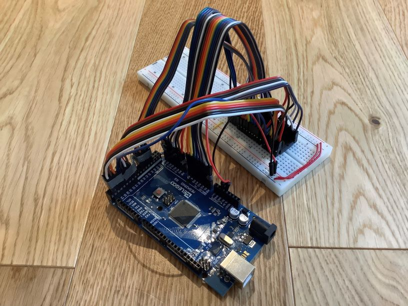
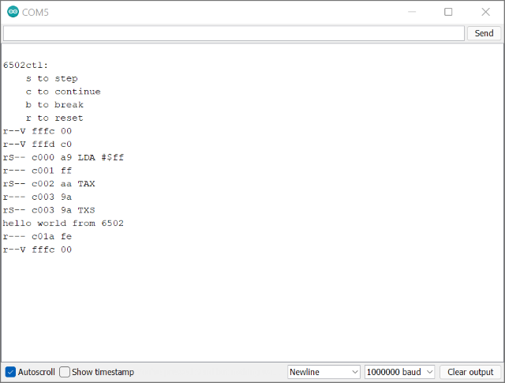

# 6502ctl - Arduino 6502 Controller

The 6502ctl project is an Arduino controller for the 6502 CPU. The controller controls all 6502 pins, including the clock signal and interrupts, and simulates an address and data bus with attached memory and an output peripheral. The controller includes a clock-cycle debugger with disassembler. An assembler is also included with the project.



## Hardware

This project requires the following hardware components:

- [Arduino MEGA 2560](https://www.arduino.cc/en/pmwiki.php?n=Main/arduinoBoardMega2560)
- [W65C02S 40 Pin PDIP](https://www.westerndesigncenter.com/wdc/documentation/w65c02s.pdf) (6502)
- [Breadboard](http://busboard.com/BB830)
- Jumper wires (39 pieces)

### Connections

Refer to the [W65C02S](https://www.westerndesigncenter.com/wdc/documentation/w65c02s.pdf) datasheet Figure 3-1 that describes the W65C02S pins.

- Address bus: connect W65C02S pins A0-A15 to Arduino pins A0-A15 (ATmega2560 ports F,K).
- Data bus: connect W65C02S pins D0-D7 to Arduino pins 49-42 (ATmega2560 port L):
    - D0 &rarr; 49
    - D1 &rarr; 48
    - ...
    - D7 &rarr; 42
- Input control: connect W65C02S input control pins to Arduino pins 22-28 (ATmega2560 port A):
    - RDY &rarr; 22
    - IRQB &rarr; 23
    - NMIB &rarr; 24
    - RESB &rarr; 25
    - SOB &rarr; 26
    - PHI2 &rarr; 27
    - BE &rarr; 28
- Output control: connect W65C02S output control pins to Arduino pins 35-30 (ATmega2560 port C):
    - RWB &rarr; 35
    - PHI2O &rarr; 34
    - SYNC &rarr; 33
    - MLB &rarr; 32
    - PHI1O &rarr; 31
    - VPB &rarr; 30
- Power: connect W65C02S VCC to Arduino 5V and W65C02S VDD to Arduino GND.
- NC Pin: DO NOT connect the W65C02S NC pin.

## Software

This software consists of the following components:

- Controller: runs on the Arduino MEGA 2560 and fully controls the 6502.
    - Provides a clock signal to the 6502. The clock signal is variable and can be fully stopped. Under normal operation the Arduino MEGA 2560 is able to produce a clock signal every 5 μs, which gives it a maximum speed of 200KHz.
    - Simulates an address bus and data bus so that the 6502 can access memory and peripherals.
    - Simulates a 16K ROM and a 4K RAM memory.
    - Simulates a memory mapped I/O range to interface with peripherals and a single character output peripheral.
    - Simulates interrupts from peripherals.
    - Includes a simple debugger that is able to single-step clock cycles. The debugger shows the address and data bus values and whether the address space is read or written. In addition the debugger will disassemble the instruction when the 6502 fetches an instruction opcode.
- Assembler: runs on the host computer and is used to produce ROM images for the 6502.

### How to use

After connecting all hardware components and the Arduino MEGA 2560 to the host computer, open this project in the Arduino IDE. Upload the sketch to the Arduino and open the Serial Monitor and set it to 1000000 baud.

You will be presented with the following (there may also be some garbage characters before this message from the serial interface - you can ignore these):

```
6502ctl:
    s to step
    c to continue
    b to break
    r to reset
r--V fffc 00
```

The 6502ctl debugger informs you of the few commands that it supports:

- `s` to step a single clock cycle
- `c` to continue (i.e. run without stepping)
- `b` to break into the debugger after continuing
- `r` to reset the 6502

The debugger follows up with the line `r--V fffc 00`, which means that the 6502 is `r`eading from hex address `$fffc` the value `$00`. The 6502 is accessing a `V`ector location. This is part of the 6502's startup/reset sequence which is explained below.

The characters `r--V` encode values from some 6502 control pins:

- `r` or `W`: RWB pin; determines whether the 6502 is trying to `r`ead or `W`rite.
- `S` or `-`: SYNC pin; determines whether the 6502 is fetching an instruction opcode.
- `-` or `M`: MLB pin; the 6502 sets this pin for some "Read-Modify-Write" instructions.
- `-` or `V`: VPB pin; determines whether the 6502 is accessing a vector location (e.g. RESET).

In the Serial Monitor enter `s` and press ENTER:

```
r--V fffd c0
```

The 6502 is `r`eading from hex address `$fffd` the value `$c0`. The 6502 is accessing a `V`ector location.

You are seeing the 6502 reset sequence. After a reset the 6502 expects to find the start of the program at location `$fffc`. Because this is a 16-bit address this is stored in locations `$fffc` and `$fffd`. The 6502 read the values `$00` and `$c0` which together comprise the address `$c000` (in little-endian format). This is where our program starts.

Enter `s` again and press ENTER:

```
rS-- c000 a9 LDA #$ff
```

The 6502 starts executing instructions at address `$c000`. It fetches the first instruction opcode and signals this via the SYNC pin. The debugger notices this and disassembles the instruction: `LDA #$ff` (load the accumulator with the immediate value `#$ff`). Note that the 6502 has not fully fetched the instruction yet; it is just that the 6502ctl debugger has looked ahead in memory to find all instruction bytes so that it could disassemble it.

Enter `s` again and press ENTER:

```
r--- c001 ff
```

The 6502 is now reading the additional instruction bytes. In this case this is the value `#$ff` that is the immediate value to be loaded into the accumulator.

Enter `s` again and press ENTER:

```
rS-- c002 aa TAX
```

The 6502 is now reading another instruction: `TAX` (transfer the accumulator to register X).

Enter `s` again and press ENTER:

```
r--- c003 9a
```

The 6502 is taking some time to execute the `TAX` instruction.

Enter `s` again and press ENTER:

```
rS-- c003 9a TXS
```

The 6502 is now reading another instruction: `TXS` (transfer register X to the stack pointer).

At this point we can just continue execution by entering 'c` and pressing ENTER:

```
hello world from 6502
```

The debugger allows the clock to run at full speed and the 6502 executes a program that sends the string `hello world from 6502` to the Serial Monitor.

We can break again into the debugger by pressing `b` and ENTER:

```
r--- c01a fe
```

We can now reset the 6502 by pressing `r` and ENTER:

```
r--V fffc 00
```

The 6502 is executing its reset sequence again.



**NOTE**: Most modern debuggers show the next statement/instruction that is going to be executed. The 6502ctl debugger always shows the last operation (not instrustion) that was executed.

### How it works

The main `loop` of 6502ctl is as follows (some detail removed for this discussion):

```C
void loop()
{
    uint16_t addr;
    uint8_t data;
    uint8_t octl;

    cli();                              // 1. Disable interrupts

    for (;;)
    {
        clock_rise();                   // 2. Clock goes high

        octl = read_octl();             // 3. Read 6502 output control pins
        addr = read_abus();             // 4. Read address from 6502 address bus
        if (octl & P6502_OCTL_PIN(RWB)) // 5. Test the RWB pin
        {
            data = read_data(addr);     // 6. Read data from simulated ROM, RAM or MMIO
            write_dbus(data);           // 7. Write data to data bus
        }
        else
        {
            data = read_dbus();         // 8. Read data from data bus
            write_data(addr, data);     // 9. Write data to simulated ROM, RAM or MMIO
        }

        clock_fall();                   // 10. Clock goes low

        if (debug_available())          // 11. Fast check if debugger is active
            debug(addr, data, octl);    // 12. Debugger implementation
    }
}
```

A few things to note:

- Arduino interrupts are disabled in order to maximize performance in the core loop. Arduino interrupts are enabled only for serial communications and the debugger.
- All communication with the 6502 happens while the clock is high.
- Communication with the 6502 does not happen via Arduino's `digitalRead` / `digitalWrite`, because this would make the loop very slow. Instead the ATmega2560 ports are accessed directly. For example to read from the address bus we do:
    ```C
    static inline uint16_t read_abus()
    {
        /* read ATmega ports designated for 6502 address bus (ABLO, ABHI) */
        return P6502_ABLO(PIN) | (P6502_ABHI(PIN) << 8);
    }
    ```
-  We want maximum performance when the debugger is not active, but we also want to be able to break execution into the debugger. Recall that we have Arduino interrupts disabled and we therefore need another method to check if there is any user input. For this purpose we perform a quick check using the `debug_available` function, which returns `true` when the debugger is active or there is user input:
    ```C
    static inline bool debug_available()
    {
        /*
        * ATmega 2560 datasheet 23.6.2
        *
        * UCSRnA – USART MSPIM Control and Status Register n A
        *
        * Bit 7 - RXCn: USART Receive Complete
        *
        * This flag bit is set when there are unread data in the receive buffer and cleared when the
        * receive buffer is empty (that is, does not contain any unread data).
        */
        return debug_step || (UCSR0A & (1 << RXC0));
    }

    ```

### Assembler

This project includes a simple 6502 assembler written in Python. The assembler understands all 6502 instructions, and supports labels and a limited set of directives.

An identifier followed by a colon (`:`) is recognized as a label that points to a particular address.

A dot (`.`) followed by an identifier specifies a directive. The recognized directives are:

- `.def SYM TEXT`: Associate a symbol with a text definition. If this symbol is encountered again, it will be replaced by its text definition.
- `.byte VAL ...`: Emit byte(s). Strings are also supported:
    - Strings enclosed in double quotes (`"`) are prefixed with a single byte containing the string length and are not zero-terminated.
    - Strings enclosed in single quotes (`'`) are not prefixed and are not zero-terminated.
- `.word VAL ...`: Emit 16-bit word(s).
- `.org ADDR`: Emit subsequent code/data starting at the specified address.

The assembler has a simple command-line usage. The following command line:

```
python 6502asm.py hello.asm -o 6502rom.h
```

Will assemble the file `hello.asm` and produce the file `6502rom.h`.

## Simulated architecture

The architecture of the simulated computer is described below:

- Address `$8000`: start of ROM. There is only 16K of ROM so it is mirrored at addresses `$8000` and `$c000`.
- Address `$0000`: start of RAM. There is only 4K of RAM so it is mirrored at addresses `$0000`, `$1000`, ..., `$7000`.
- Address `$00`-`$7f`: the first 128 bytes of RAM are used as memory mapped I/O registers, which the 6502 uses to interface with "peripherals" and handle interrupts. There is currently a single character output peripheral. The currently defined registers are:
    - `IRQN`: Interrupt ReQuest Number (0). Prior to raising an interrupt the 6502ctl places a number that identifies the interrupting peripheral to the IRQN. The 6502 interrupt request handler writes the value `0` to the IRQN to signal that the interrupt has been handled.
    - `OREG`: Output register (64; 32 bytes long). In order to perform character output, programs place a string in location `OREG+1`, ..., `OREG+31` and then place the length of the string in `OREG`. This signals to the controller to send the string to the Arduino IDE Serial Monitor. Upon delivery of the message to the Serial Monitor, the value `0` is placed in `OREG`, the value 64 (the address of `OREG`) is placed in the `IRQN` and an interrupt is raised to inform the 6502 program that output has been completed.
    - `IREG`: Input register (96; 32 bytes long). Reserved for future use.
